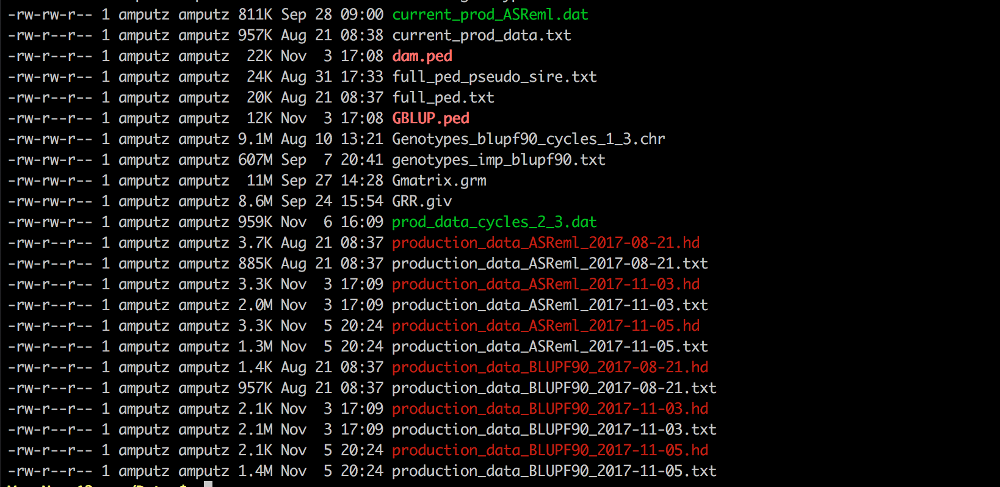

# File Extension Highlighting in Linux

Here is the `dir_colors` file and installation you need for your Linux server. This file goes in your home folder. 

```bash
chmod 775 installdir_colors
./installdir_colors
```

Add this line to your `.bashrc` or `.bash_profile`

```bash
eval $(dircolors ~/.dir_colors)
```

And then you should see:



If you go into the .dircolors file on your server, you can see the extensions that are highlighted. You can set the colors however you want. I believe the first 2 numbers 00 or 01 is with and without bolding. The second set after the `;` is the color itself. If you have a new one, just edit this file by adding

```bash
.new 00;31
```

in the `.dircolors` file. 
